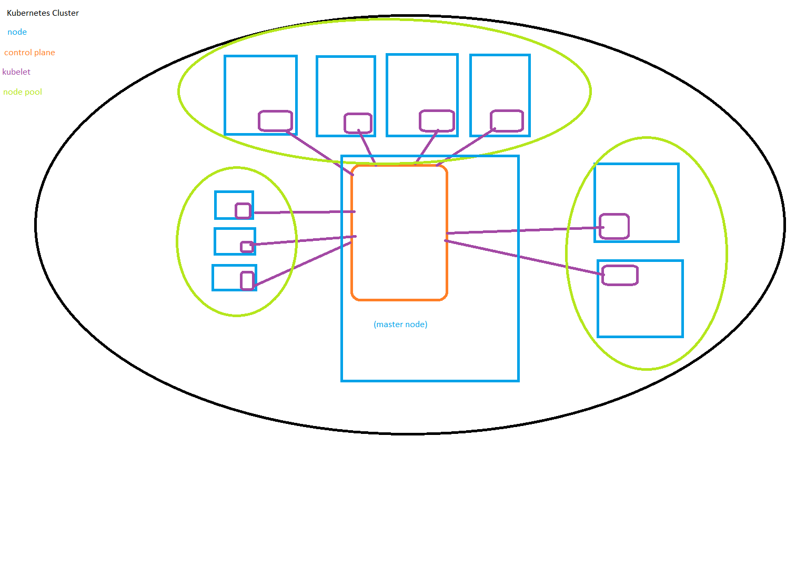
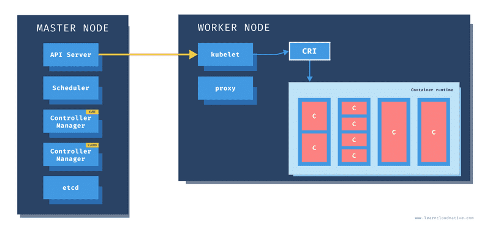

# What is Kubernetes? [docs](https://kubernetes.io/docs/concepts/overview/)
Kubernetes is a software solution for "Container Orchestration." It provides the means of managing containers on a large scale, as well as tracking them. This service is typically used with a cloud provider like Azure, AWS, or GCP. By combining Kubernetes with cloud services you end up with a powerful service that provides significant levels of automated service for you:
- Service Discovery
    - can control how you expose your containers to end users
- Load Balancing
    - can distribute network traffic so the deployment is stable
- Storage Orchestration
    - can mount storage systems of your choice:
        - local storage
        - cloud storage
    - can automate rollouts and rollbacks
    - can set desired states and Kubernetes will change the actual state to match the desired state you determine
- Automatic Bin Packing
    - you can tell Kubernetes the physical requirements (think cpu and ram) each container in a cluster needs and it will adjust your nodes to try and optimize your resources
- Self Healing
    - can restart containers that fail
    - can replace containers
    - can kill containers that don't respond to user defined health checks
    - will not adverstise nodes to clients till they are ready
- Secrets & Security
    - Can store/manage sensitive information
    - Can deploy/update secrets & app configurations without rebuilding container images
# Architecture [docs](https://kubernetes.io/docs/concepts/architecture/)



# Cluster
Kubernetes works in units called "clusters". Clusters are groups of servers (referenced as "nodes") that are used to manage your deployment. You could have one cluster per region, or per data center, it's up to you and your budget. There are two kinds of nodes to be aware of: the Control Plane node, and worker nodes

## Control Plane [docs](https://kubernetes.io/docs/concepts/overview/components/)
The control plane is the main access point into the cluster, and it is the node that manages the other worker nodes in the cluster. A Master Node should not be running the application: it should be managing the nodes that run the application. The Control Plane should be run on a linux system
- Kube-Controller Manager
    - the object that manages all other controller objects
    - typically there will be multiple controller managers: 3 normal, 5 for extra resiliency
        - one leader object, the rest are proxies
    - different controllers have responsibility for different parts of the cluster
        - node controller
        - deployment controller
        - etc
    - these controllers watch the cluster for what they are responsible and work to ensure the observed state of the cluster matches the desired state
- Kube-Scheduler
    - watches the api server for new work
    - assigns work to cluster nodes
- Cluster Store
    - only persistent component of control plane
        - stores state data and config information
    - Etcd
        - a small database of key-value pairs necessary for running the cluster
        - based on mySQL database
    - can distribute it to create replicas
- Kube-Api-Server
    - gateway to the cluster
        - handles all communication from users via kubectl for the control plane
            - api-server handles authorizig/authentication/validation of the requests
            - gives instructions to other control plane features to deploy/manage the application
        - handles communication from worker nodes
        - handles communication from other components of the control plane
    - a RESTful API server
        - consumes yml and json
    - contains resources for all the different Kubernetes objects that can be created and manipulated
- Kube-dns
    - DNS specifically for locating Kubernetes Objects
    - allows Kubernetes objects to have seperate IP addresses from the node they operate on

## Worker Node [docs](https://kubernetes.io/docs/concepts/overview/components/)
Worker nodes can be run on either linux or windows, and they are responsible for handling the work sent by the scheduler. In Kubernetes this work comes in the form of pods (one or more containers grouped together). Worker nodes are composed of multiple components
- Kublet
    - agent that runs every cluster node
    - registers the cluster to the node
        - adds the cpu, ram, and other resources to the cluster's resource pool
    - watches the api server for work
        - pulls the specs and runs the pods
- container runtime
    - uses Container Runtime Interface (CRI)
        - used to just use docker, is more flexible now
    - responsible for stopping and running containers
- Kube-Proxy
    - networking component of the node
    - ensures every pod gets its own unique IP address
        - if multiple containers are in the pod they will share the same IP address
        - can reach out to other containers via ports
    - provides light weight load balacing across the pods
        - happens behind a service
# Objects [docs](https://kubernetes.io/docs/concepts/overview/working-with-objects/kubernetes-objects/)
Any persistent Entity in Kubernetes is called an "object". Objects are configured (typically) by creating YAML files and then exposing those files to Kubernetes. Objects will describe one of the following:
- What containerized applications are running (and on which nodes)
- The resources available to those applications
- The policies around how those applications behave, such as restart policies, upgrades, and fault-tolerance

These declared objects create the "desired state" of your cluster: Kubernetes will work to ensure that the "current state" of the cluster matches the "desired state." Should the two be different, Kubernetes will adjust things until they match. This means that Kubernetes works with a "declarative" model. You don't command Kubernetes to do things: you declare what you want, and Kubernetes abstracts away the process for making it happen. You "declare" the desired state with YAML configuration files, and Kubernetes handles the rest.

# Nodes [docs](https://kubernetes.io/docs/concepts/architecture/nodes/)
A node is a virtual or physical machine that hosts your pods. Depending on your cluster you could have one or many nodes handling your deployment. Nodes contain the following components:
- [kubelets](https://kubernetes.io/docs/reference/command-line-tools-reference/kubelet/)
    - these are the main Kubernetes agents in a cluster
    - kublets register a node to the cluster
        - think adding cpu, ram, any other necesary resources for the node to be able to host pods
    - the kublet watches the API server for work assigned by the scheduler
- [container runtime](https://kubernetes.io/docs/setup/production-environment/container-runtimes/)
    - this component handles container runtime
        - Kubernetes by itself doesn't have the resources for handling containers
        - the container runtime component has the Container Runtime Interface: this tool lets docker or another containerization tool be interfaced with by Kubernetes
            - think of it like Hibernate abstracting away SQL dialect
- [kube-proxy](https://kubernetes.io/docs/reference/command-line-tools-reference/kube-proxy/)
    - this component handles networking for the node
        - the kube-proxy ensures every pod gets a unique IP address
            - multiple containers in a pod will share an IP address
            - this allows your containers to be interacted with via their designated ports
        - accessing the containers within the pods requires a service

A helpful link for understanding the difference between the master(control plane) and worker nodes: [master/worker node breakdown](https://startkubernetes.com/blog/k8s_master_and_worker_nodes)

# Pods [docs](https://kubernetes.io/docs/concepts/workloads/pods/)
pods are atomic units of deployment within Kubernetes: containers will ALWAYS run in a pod, and multiple containers may exist within the same pod. This makes the pod itself a wrapper to containers. It provides a way of sharing an execution environment, all containers will their pods' IP address, ports, file system, etc. This can be useful if, say, you are hosting your own database and want to connect your small web app to this local database.

That being said, "loose coupling" is considered to be best practice. This is where a pod has a single container and resources are shared only when absolutely necessary. This is particularly helpful because a Pod is only considered "ready" when all its containers are running successfully.




# Volumes [docs](https://kubernetes.io/docs/concepts/storage/volumes/)
Volumes are storage options that can be attached to a pod, and there are two kinds: ephemeral and persistent. An ephemeral volume has the same lifespan of the pod it is attached to: when the pod is destroyed the content of the volume is also deleted. Persistent volumes, on the other hand, have a lifespan that goes beyond the pod. These typically are services like AWS EBS, Azure file, etc. When data is persisted with these services the content is accessible to all pods that are linked to them, no matter how many times the pods are destroyed and recreated.

# Services [docs](https://kubernetes.io/docs/concepts/services-networking/service/)
Services are objects that can be used to expose applications running in pods. This can be done using a simple service, but there are also a few spcific kinds of services that can be used to easily wrap/allow access to your apps:
- ClusterIP
- NodePort
- LoadBalancer

A ClusterIP services allows you to wrap one or more pods behind a single INTERNAL access point. This means that all the pods associated with the service are accessible behind a single IP address that K8 sets up. However, this access point is only available within the cluster (cross pod communication can happen): this type of service does not allow external access to the wrapped pods.

A NodePort is similar to a ClusterIP in that it wraps one or more pods behind a single IP address, but a NodePort will expose the access point to external traffic. While this is an option for creating access to your application, it is not recommended for a production environment, due to the limited ability to perform any sort of external load balancing. It is, however, a valid choice for a development environment.

A LoadBalancer is the prefered choice for a production environment: it determines where external requests to your cluster are sent, and is typically used with an Ingress object to facilitate which service will handle an external request to your application. However, load balancers are usually expensive, which can be a drawback for a newcomer to Kubernetes.

# Helm [K8 article about helm](https://kubernetes.io/blog/2016/10/helm-charts-making-it-simple-to-package-and-deploy-apps-on-kubernetes/)
Helm is a chart manager for Kubernetes: think of a chart as a bundle of information necessary for creating a K8 object. You can install/uninstall charts from a cluster with Helm, and you can also use Helm to create objects in your cluster. 

# Ingress ([Ingress-nginx chart info](https://github.com/kubernetes/ingress-nginx/tree/main/charts/ingress-nginx), [nginx ingress controller info](https://kubernetes.github.io/ingress-nginx/deploy/#quick-start))
Ingress objects contain a set of rules for determining which services should handle external http requests into your cluster. a typical setup involves an Ingress object and a load balancer service working in tandem: the load balancer is the initial entrypoint for any external http request, but by itself, a load balancer doesn't know where to send the request. This is where the Ingress comes into play: the load balancer sends the request to the ingress service, which will then send the request to the propper service based upon the rules you specified when creating the Ingress object.


# Kubectl [docs](https://kubernetes.io/docs/reference/kubectl/)
## [Kubectl cheat sheet](https://kubernetes.io/docs/reference/kubectl/cheatsheet/)

You can communicate with the control plane of a cluster by using kubectl. To configure your cluster kubectl will attempt to find a file named <code>config</code> in the <code>$HOME/.kube</code> directory. Any command you want to send to the cluster needs to start with <code>kubectl</code>.

to determine which cluster you communicate with, or to make configuration changes, use the <code>config</code> command
```cli
kubectl config [option]
```

to create or update a resource in your cluster you can use the <code>apply</code> command. You can use the "-f" flag to indicate one or more yaml,yml, and/or json files, or you can indicate a directory
```cli
kubectl apply -f ./my-manifest.yaml            # create resource(s)
kubectl apply -f ./my1.yaml -f ./my2.yaml      # create from multiple files
kubectl apply -f ./dir                         # create resource(s) in all manifest files in dir
kubectl apply -f https://git.io/vPieo          # create resource(s) from url
```

you can view the resources in your cluster with the get command
```cli
kubectl get services                          # List all services in the namespace
kubectl get pods --all-namespaces             # List all pods in all namespaces
kubectl get pods -o wide                      # List all pods in the current namespace, with more details
kubectl get deployment my-dep                 # List a particular deployment
kubectl get pods                              # List all pods in the namespace
kubectl get pod my-pod -o yaml                # Get a pod's YAML
```

you can update your resources in a more controlled manner using the rollout command
```cli
kubectl set image deployment/frontend www=image:v2               # Rolling update "www" containers of "frontend" deployment, updating the image
kubectl rollout history deployment/frontend                      # Check the history of deployments including the revision
kubectl rollout undo deployment/frontend                         # Rollback to the previous deployment
kubectl rollout undo deployment/frontend --to-revision=2         # Rollback to a specific revision
kubectl rollout status -w deployment/frontend                    # Watch rolling update status of "frontend" deployment until completion
kubectl rollout restart deployment/frontend                      # Rolling restart of the "frontend" deployment
```